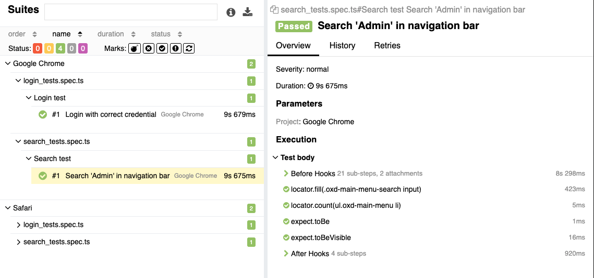

# Sample Web Automation
Based on Microsoft Playwright which enables reliable end-to-end testing for modern web apps

## Features
- All Playwright features: run on multiple browsers, run parallel, auto-waits, screenshot/video record, trace, ...
- Page Object Model
- Run on multiple environments: staging, sandbox
- Allure report
- Post report to Slack

## Project structure
| Folder        | Description                     |
| ------------- | ------------------------------- |
| `env`         | Environment variables           |
| `fixtures`    | Fixtures                        |
| `pages`       | Pages with elements and methods |
| `test-data`   | Test data                       |
| `tests`       | Tests                           |
| `utils`       | Utility functions               |
| `test-report` | Test report                     |

## Prerequisite
| Description    | Command             |
| -------------- | ------------------- |
| Install NodeJS | `brew install node` |

## Scripts
| Description                 | Command                              |
| --------------------------- | ------------------------------------ |
| Install dependencies        | `npm install`                        |
| Install Playwright browsers | `npx playwright install --with-deps` |
| Run tests on staging        | `npm run web:staging`                |
| Run tests on sandbox        | `npm run web:sandbox`                |
| Generate report             | `npm run web:report`                |

## Report
View report in "test-report" folder

